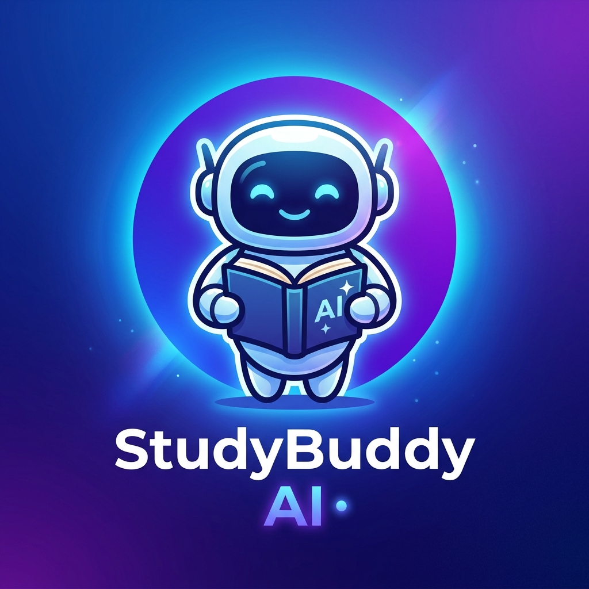

# 📚 StudyBuddy AI

> **Hacktoberfest 2026 Challenge Entry** — Theme: *"Build for a Friend"*



**StudyBuddy AI** is a lightweight, full-stack web application that transforms long, dense study notes into concise summaries, key takeaways, and 5 interactive practice exam questions with answers. Powered strictly by **Open-Source / Open-Weight AI models** (Qwen 2.5 72B, Llama 3.3 70B, Mistral 7B).

---

## 🎯 Who It Was Built For & The Problem It Solves

### The Backstory
This project was built for a university student and friend who gets overwhelmed when preparing for exams from long 20-to-30-page study notes and textbook chapters.

### The Problem
* **Information Overload:** Students re-reading raw textbook notes spend hours without actively retaining key principles.
* **Passive Studying vs Active Recall:** Studying is most effective when testing yourself, but manually creating quiz questions takes too much time right before an exam.

### The Solution
StudyBuddy AI gives any student an instant **Study Pack** in under 5 seconds:
1. **Concise Overview:** A 2–4 sentence summary + bulleted core takeaways.
2. **5 Practice Exam Questions:** Targeted questions designed to test comprehension.
3. **Instant Self-Grading & Flashcards:** Revealable answers with explanations and an interactive flashcard mode to test active recall before exam day.

---

## 🤖 How the AI Works

1. **Input & Extraction:** The student pastes raw study notes into the application.
2. **Open-Weight Model Processing:** The Express backend formats a structured system prompt requiring strictly typed JSON output and sends it to an open-weight foundation model:
   * **Qwen 2.5 72B Instruct** (via Hugging Face Serverless / OpenRouter)
   * **Llama 3.3 70B Instruct** (via Groq / Hugging Face / OpenRouter)
   * **Mistral 7B Instruct v0.3** (via Hugging Face)
   * **Local Ollama** (`llama3` / `qwen2.5` running locally on `http://localhost:11434`)
3. **Structured JSON Parsing & Backstop:** The server validates and parses the JSON schema (`summary`, `keyTakeaways`, `qaPairs`). If API keys are absent, a smart heuristic extractor seamlessly generates a formatted study pack so the application is 100% runnable out-of-the-box.

---

## 💡 Why Using Open-Source / Open-Weight AI is Useful

* **Data Privacy & Sovereignty:** Student study notes and university materials are not used to train proprietary closed-source models.
* **Local Offline Execution:** Open-weight models like Llama 3 and Qwen 2.5 can be downloaded and run 100% offline via Ollama without relying on external corporate APIs.
* **Transparency & Reproducibility:** Model architecture, training data disclosures, and weight files are publicly accessible and auditable by the global developer community.
* **Cost Efficiency:** Reduces expensive per-token costs by utilizing serverless inference tiers or self-hosted infrastructure.

---

## 🛠️ Technologies Used

* **Frontend:** React 18, Vite, Vanilla CSS3 (Custom Glassmorphic Dark Design System), Lucide Icons, Canvas Confetti
* **Backend:** Node.js, Express.js, Cors, Dotenv
* **AI Integration:** Hugging Face Inference API, Groq API, OpenRouter API, Ollama Local API
* **Models:** Qwen/Qwen2.5-72B-Instruct, meta-llama/Llama-3.3-70B-Instruct, mistralai/Mistral-7B-Instruct-v0.3

---

## 🚀 Quick Start Guide (How to Install & Run Locally)

Follow these simple steps to run StudyBuddy AI locally on your computer.

### Prerequisites
* **Node.js**: v18.0.0 or higher
* **npm**: v9.0.0 or higher

### Step 1: Clone the Repository & Install Dependencies
```bash
# Navigate into the project folder
cd hacktoberfest-weekend-2026

# Install backend dependencies & auto-trigger client installation
npm install
```

### Step 2: Configure Environment Variables (Optional)
Copy `.env.example` to `.env`:
```bash
cp .env.example .env
```
> **Note:** API keys are optional! If left blank, StudyBuddy AI will run in offline simulation mode or attempt public HF inference so you can test immediately without any API keys.
> 
> To connect a live API key, add your free token in `.env`:
> ```env
> HF_TOKEN=your_free_huggingface_token_here
> GROQ_API_KEY=your_groq_api_key_here
> ```

### Step 3: Run the Application
Start both the backend server and Vite React frontend concurrently:
```bash
npm run dev
```

Open your browser and navigate to:
👉 **`http://localhost:3000`** (or `http://localhost:5000` for API backend)

---

## 🧪 Production Build & Standalone Server

To build the optimized static bundle and run it on a single Express port:
```bash
# Build client
npm run build

# Start production server
npm start
```

---

## 📄 License
Released under the [MIT License](LICENSE). Built with ❤️ for Hacktoberfest 2026.